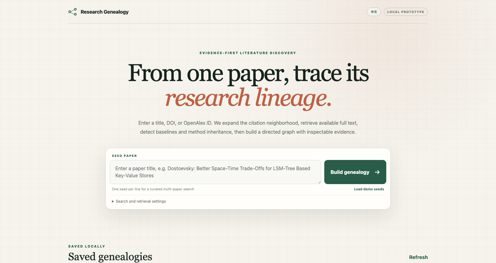
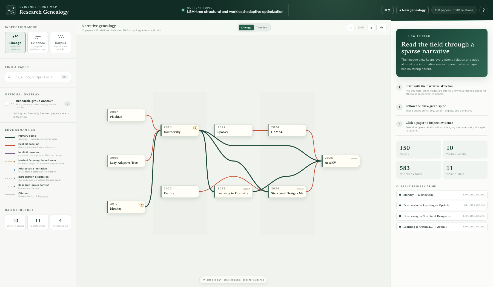
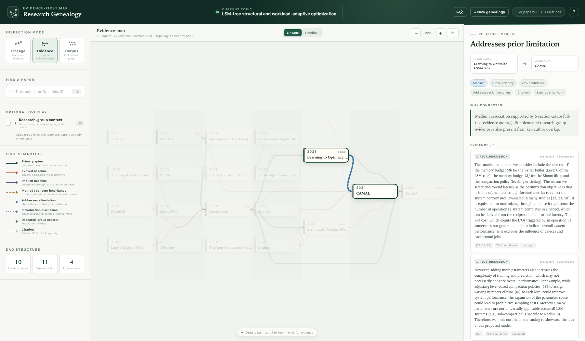
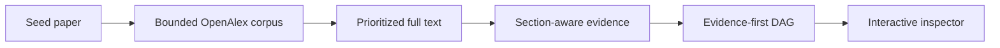

# Research Genealogy

Turn one seed paper into an evidence-backed map of the work it follows—and the
work that follows it.



Citation graphs show who cites whom. Research Genealogy asks the harder
question: **which papers actually continue a technical line of work?** It
retrieves available full text, reads where and how earlier work is discussed,
and builds an inspectable directed graph instead of treating every citation as
equally meaningful.

## What it does

- Accepts a title, DOI, or OpenAlex ID as the seed.
- Expands a bounded backward/forward citation neighborhood with OpenAlex.
- Prioritizes the seed and nearby descendants for full-text retrieval.
- Falls back through OpenAlex, DOI, arXiv, DBLP, configured pages, and optional
  first/corresponding-author homepage discovery.
- Separates bibliography mentions from Introduction/Preliminaries discussion,
  experimental baselines, and inherited methods or artifacts.
- Finds explicit and implicit baselines—for example, a benchmark artifact can
  lead back to the paper that introduced it even when that paper is not named
  beside the result table.
- Adds first/second/corresponding-author overlap as a subordinate research-group
  signal without letting it replace technical evidence.
- Produces a sparse narrative lineage, a complete evidence network, and a full
  corpus graph.
- Keeps every result as a local, reopenable bundle with evidence passages,
  source URLs, checksums, logs, and graph artifacts.
- Ships with English and Chinese UI. English is the default; `?lang=zh` is a
  shareable Chinese view.

## Relationship model

| Strength | Meaning |
| --- | --- |
| Weak | Citation or Related Work mention |
| Medium | Substantive Introduction/Preliminaries discussion, stated limitation, or supplementary key-author overlap |
| Strong | Experimental baseline, implicit artifact baseline, or direct method dependency |

The graph remains a DAG and may give a paper multiple parents. A strong edge is
not forced merely because two papers are textually similar.

## Three views, two layouts

**Lineage** keeps every strong relation, the dominant spine, and at most one
informative medium parent for a paper with no strong parent. Other evidence is
revealed when a paper is selected.



**Evidence** shows every medium and strong relation for verification. **Corpus**
adds the complete in-corpus citation graph. Weak citations stay local until a
paper is selected in the first two views.



The default topology layout balances DAG depth, crossing reduction, and
obstacle-aware edge lanes. Timeline mode places publication year on the x-axis.
Pan, zoom, search, fit, edge hover, click-to-inspect, and shareable selection
URLs are built in.

## How it works



The main pipeline is deterministic after retrieval. An LLM is optional and is
currently used only to discover likely author publication pages when normal
full-text routes fail; every returned URL is treated as untrusted and accepted
only after PDF signature and title validation.

## Quick start

Requirements: Python 3.10+ and `pdftotext` from Poppler.

```bash
# macOS
brew install poppler

# Ubuntu / Debian
sudo apt-get install poppler-utils
```

From a clone of this repository:

```bash
python3 -m venv .venv
source .venv/bin/activate
python -m pip install -e ".[dev]"
cp .env.example .env
```

Add an OpenAlex key to `.env`:

```dotenv
OPENALEX_API_KEY=your_key_here
```

Start the local app:

```bash
python scripts/09_serve_app.py --port 4174
```

Open <http://127.0.0.1:4174/>. The bundled example is available immediately at
<http://127.0.0.1:4174/web/> and does not require an API call.

You can run the same workflow from the CLI:

```bash
python scripts/08_run_search.py \
  --seed "Dostoevsky: Better Space-Time Trade-Offs for LSM-Tree Based Key-Value Stores"
```

## Optional author-homepage fallback

No LLM key is required for the main pipeline. To enable hosted author-page
search after deterministic routes fail, set either provider key:

```dotenv
# Option A — OpenAI; defaults to gpt-5.4-mini
OPENAI_API_KEY=your_key_here

# Option B — DeepSeek; defaults to deepseek-v4-flash
DEEPSEEK_API_KEY=your_key_here
```

If both keys exist, choose one explicitly:

```dotenv
AUTHOR_SEARCH_PROVIDER=openai  # or deepseek
AUTHOR_SEARCH_MODEL=gpt-5.4-mini
```

OpenAI uses one
[Responses API web-search](https://developers.openai.com/api/docs/guides/tools-web-search)
call with structured output. DeepSeek retains its two-stage Responses protocol.
Advanced users can
set `AUTHOR_SEARCH_PROVIDER=openai_compatible` together with
`AUTHOR_SEARCH_API_KEY`, `AUTHOR_SEARCH_BASE_URL`, and `AUTHOR_SEARCH_MODEL` if
their endpoint implements Responses `web_search` and JSON-schema output.

Every URL returned by any provider remains untrusted: the resolver rejects
private-network URLs, caps candidates, downloads the file, checks its PDF
signature, and validates the title before acceptance. Without a hosted key,
OpenAlex/DOI/arXiv/DBLP and configured-page routes still run. Ollama is not
required. Never commit `.env`; it is ignored by Git.

## Result bundles

Each search is saved under `data/searches/<result-id>/`:

```text
request.json              normalized request and fingerprint
status.json               progress, warnings, counts, final state
inputs/                   configuration and full-text selection
raw/openalex/             cached provider responses
raw/pdfs/                 title-validated PDFs
raw/fulltext/             retrieval attempts and provenance
corpus.json               bounded paper corpus
citation_graph.json       normalized citation candidates
evidence.json             section-aware evidence atoms
outputs/                  DAG, dominant tree, DOT, and SVG
inspector.json            self-contained browser payload
logs/                     pipeline output and tracebacks
artifact_manifest.json    size and SHA-256 of saved artifacts
```

Opening a saved result never reruns retrieval or inference. Generated searches,
PDFs, caches, and credentials remain local and are excluded from Git.

## Development

```bash
python -m pytest -q
node --check web/i18n.js
node --check web/home.js
node --check web/app.js
```

Key directories:

```text
src/        corpus, retrieval, evidence, inference, storage, server
scripts/    pipeline and reproducibility entry points
web/        dependency-free bilingual UI
configs/    retrieval and audited example configuration
tests/      unit and frontend contract tests
reports/    prototype experiments and design history
```

This is a research prototype: full-text availability and imperfect publication
metadata can still limit recall. The interface exposes the underlying evidence
so missing or incorrect edges can be audited instead of hidden behind a score.

## License

[MIT](LICENSE)
